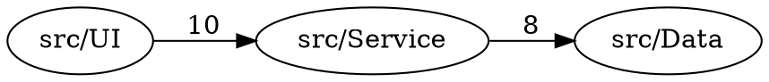

# Graph Visualization & Reporting

ArchUnitCSharp can export your architecture as dependency graphs in multiple formats for visualization and analysis.

## Overview

Extract and visualize your dependency graph:

```csharp
var graph = ProjectGraph("./MyProject.csproj")
    .CollapseToFolderDepth(2);         // Aggregate to folder level

await graph.ExportToFileAsync(
    GraphFormat.Mermaid,
    "architecture.md"
);
```

## Supported Formats

ArchUnitCSharp exports to 6 formats, each suited for different use cases:

### 1. Mermaid Diagram

**File**: `architecture.md`  
**Tool**: https://mermaid.live (online) or VS Code extension  
**Best for**: Sharing diagrams in documentation, GitHub README


**Example output**:
```
graph LR
    src_UI["src/UI"]
    src_Service["src/Service"]
    src_Data["src/Data"]
    
    src_UI -->|10 deps| src_Service
    src_Service -->|8 deps| src_Data
```

### 2. Graphviz DOT

**File**: `architecture.dot`  
**Tool**: Graphviz (https://graphviz.org), online viewers  
**Best for**: Professional diagrams, publishing

```bash
# Convert to SVG
dot -Tsvg architecture.dot -o architecture.svg

# Convert to PNG
dot -Tpng architecture.dot -o architecture.png
```

**Example output**:


### 3. D2 Language

**File**: `architecture.d2`  
**Tool**: https://d2lang.com (online editor)  
**Best for**: Modern, readable syntax, interactive diagrams

```bash
# Install D2
brew install d2  # macOS
# or download from https://d2lang.com

# Render to SVG
d2 architecture.d2 architecture.svg
```

**Example output**:
```d2
UI -> Service: 10 dependencies
Service -> Data: 8 dependencies
Data: Database layer

style UI: {fill: #e8f4f8}
style Service: {fill: #fff8e8}
style Data: {fill: #e8f8e8}
```

### 4. JSON Export

**File**: `architecture.json`  
**Tool**: Programmatic processing, custom tools  
**Best for**: Analyzing graph programmatically, CI/CD integration

```json
{
  "nodes": [
    {"id": "src/UI", "type": "folder", "dependencies": 2},
    {"id": "src/Service", "type": "folder", "dependencies": 1},
    {"id": "src/Data", "type": "folder", "dependencies": 0}
  ],
  "edges": [
    {"source": "src/UI", "target": "src/Service", "count": 10},
    {"source": "src/Service", "target": "src/Data", "count": 8}
  ]
}
```

### 5. CSV Export

**File**: `architecture.csv`  
**Tool**: Excel, Google Sheets, CSV parsers  
**Best for**: Analysis in spreadsheets, statistical tools

```csv
Source,Target,Count,Type
src/UI,src/Service,10,file
src/Service,src/Data,8,file
src/UI,NuGet:Newtonsoft.Json,3,external
```

### 6. HTML Interactive View

**File**: `architecture.html`  
**Tool**: Web browser  
**Best for**: Interactive exploration, presentations

Features:
- Click to expand/collapse nodes
- Hover for dependency details
- Search for specific components
- Export to PNG from browser

## Basic Usage

### Export All Formats

```csharp
var graph = ProjectGraph("./MyProject.csproj");

// Export to all formats
await graph.ExportToFileAsync(GraphFormat.Mermaid, "output/architecture.md");
await graph.ExportToFileAsync(GraphFormat.DOT, "output/architecture.dot");
await graph.ExportToFileAsync(GraphFormat.D2, "output/architecture.d2");
await graph.ExportToFileAsync(GraphFormat.JSON, "output/architecture.json");
await graph.ExportToFileAsync(GraphFormat.CSV, "output/architecture.csv");
await graph.ExportToFileAsync(GraphFormat.HTML, "output/architecture.html");
```

### Folder Aggregation

Reduce complexity by collapsing to folder level:

```csharp
// Export at file level (detailed)
var detailed = ProjectGraph("./MyProject.csproj");
await detailed.ExportToFileAsync(GraphFormat.Mermaid, "detailed.md");

// Export at folder level (abstracted)
var folderLevel = ProjectGraph("./MyProject.csproj")
    .CollapseToFolderDepth(1);  // Group by immediate parent folder
await folderLevel.ExportToFileAsync(GraphFormat.Mermaid, "folders.md");

// Export at area level (highly abstracted)
var areaLevel = ProjectGraph("./MyProject.csproj")
    .CollapseToFolderDepth(2);  // Group by first two levels
await areaLevel.ExportToFileAsync(GraphFormat.Mermaid, "areas.md");
```

**Folder depth examples**:
- Depth 1: `src/Features/` → `src/`
- Depth 2: `src/Features/Orders/` → `src/Features/`
- Depth 3: `src/Features/Orders/Models/` → `src/Features/Orders/`

### Filtering Dependencies

```csharp
// Include only internal dependencies (exclude NuGet packages)
var internal = ProjectGraph("./MyProject.csproj")
    .ExcludeExternalDependencies();
await internal.ExportToFileAsync(GraphFormat.Mermaid, "internal.md");

// Focus on specific components
var focused = ProjectGraph("./MyProject.csproj")
    .FocusOn("src/Features/Orders");  // Only show Orders and its dependencies
await focused.ExportToFileAsync(GraphFormat.Mermaid, "orders.md");

// Include external dependencies
var full = ProjectGraph("./MyProject.csproj")
    .IncludeExternalDependencies();
await full.ExportToFileAsync(GraphFormat.Mermaid, "full.md");
```

## Advanced Scenarios

### Generate Multiple Views

Create different views for different audiences:

```csharp
var graph = ProjectGraph("./MyProject.csproj");

// 1. Architecture view for architects
var archView = graph
    .CollapseToFolderDepth(2)
    .ExcludeExternalDependencies();
await archView.ExportToFileAsync(GraphFormat.Mermaid, "architecture-high-level.md");

// 2. Dependency view for developers
var devView = graph
    .CollapseToFolderDepth(1)
    .IncludeExternalDependencies();
await devView.ExportToFileAsync(GraphFormat.JSON, "dependencies-detailed.json");

// 3. External dependency view for security
var extView = graph
    .ExcludeInternalDependencies()
    .IncludeExternalDependencies();
await extView.ExportToFileAsync(GraphFormat.CSV, "external-dependencies.csv");
```

### Cycle Detection with Visualization

```csharp
// Find cycles using rules
var cycleRule = ProjectFiles("./MyProject.csproj")
    .InPath("src/**")
    .Should()
    .HaveNoCycles();

var violations = await cycleRule.CheckAsync();

if (violations.Count > 0)
{
    // Export only the cycle subgraph
    var graph = ProjectGraph("./MyProject.csproj");
    var cycleNodes = violations
        .OfType<CyclicDependency>()
        .SelectMany(c => c.FilesInCycle)
        .Distinct();
    
    var cycleView = graph.FocusOn(cycleNodes.ToArray());
    await cycleView.ExportToFileAsync(GraphFormat.Mermaid, "cycles.md");
}
```

### CI/CD Integration

Export graph automatically in CI/CD:

```csharp
public class ArchitectureExportTask
{
    public async Task ExportArchitectureAsync(string projectPath, string outputDir)
    {
        var graph = ProjectGraph(projectPath);
        
        // Create output directory
        Directory.CreateDirectory(outputDir);
        
        // Export multiple views
        await graph
            .CollapseToFolderDepth(2)
            .ExcludeExternalDependencies()
            .ExportToFileAsync(GraphFormat.Mermaid, 
                Path.Combine(outputDir, "architecture.md"));
        
        await graph
            .CollapseToFolderDepth(2)
            .ExportToFileAsync(GraphFormat.DOT,
                Path.Combine(outputDir, "architecture.dot"));
        
        await graph
            .ExportToFileAsync(GraphFormat.JSON,
                Path.Combine(outputDir, "architecture.json"));
    }
}
```

**Usage in GitHub Actions**:
```yaml
- name: Export Architecture
  run: |
    dotnet build
    dotnet run --project ./tools/ArchExport.csproj -- \
      --project ./src/MyProject.csproj \
      --output ./docs/architecture
    
- name: Commit Changes
  run: |
    git add docs/architecture/**
    git commit -m "chore: update architecture diagrams" || true
    git push
```

### Analysis from Exported Data

```csharp
// Read exported JSON for analysis
var json = await File.ReadAllTextAsync("architecture.json");
var graph = JsonConvert.DeserializeObject<ArchitectureGraph>(json);

// Analyze statistics
var statistics = new
{
    TotalNodes = graph.Nodes.Count,
    TotalEdges = graph.Edges.Count,
    AverageDependencies = graph.Edges.GroupBy(e => e.Source).Average(g => g.Count()),
    MostDependedOn = graph.Edges
        .GroupBy(e => e.Target)
        .OrderByDescending(g => g.Count())
        .First()
        .Key,
    LeastDependedOn = graph.Nodes
        .Where(n => !graph.Edges.Any(e => e.Target == n.Id))
        .ToArray()
};

Console.WriteLine($"Total dependencies: {statistics.TotalEdges}");
Console.WriteLine($"Most depended on: {statistics.MostDependedOn}");
```

## Format-Specific Tips

### Mermaid
- Best for documentation and GitHub README
- Render online at https://mermaid.live
- VS Code extension available
- Limited styling options

### Graphviz (DOT)
- Professional quality diagrams
- Export to SVG, PNG, PDF
- Manual layout control possible
- Steeper learning curve

### D2
- Modern, readable syntax
- Interactive online editor
- Fast rendering
- Good for presentations

### JSON
- Program against graph structure
- Parse and analyze
- Import into custom tools
- Suitable for CI/CD processing

### CSV
- Import into Excel/Sheets
- Statistical analysis
- Sharing with non-technical stakeholders
- Easy to diff in git

### HTML
- Interactive exploration
- No external tools needed
- Browser-based
- Good for stakeholder presentations

## Performance

### Large Graphs

For large projects (1000+ files):

```csharp
// Aggregate to reduce complexity
var simplified = ProjectGraph("./MyProject.csproj")
    .CollapseToFolderDepth(3);          // Collapse deep paths
await simplified.ExportToFileAsync(GraphFormat.Mermaid, "simplified.md");

// Or exclude external dependencies
var internal = ProjectGraph("./MyProject.csproj")
    .ExcludeExternalDependencies();
await internal.ExportToFileAsync(GraphFormat.Mermaid, "internal.md");

// Or focus on area of interest
var area = ProjectGraph("./MyProject.csproj")
    .FocusOn("src/Features");
await area.ExportToFileAsync(GraphFormat.Mermaid, "features.md");
```

### Caching

Graph is built once and cached:

```csharp
var graph = ProjectGraph("./MyProject.csproj");

var view1 = graph.CollapseToFolderDepth(1);
var view2 = graph.CollapseToFolderDepth(2);
// Both use same cached base graph

var exp1 = await view1.ExportToFileAsync(GraphFormat.Mermaid, "view1.md");
var exp2 = await view2.ExportToFileAsync(GraphFormat.Mermaid, "view2.md");
// Each export is independent, no re-analysis
```

## Testing

Validate exports in tests:

```csharp
[TestFixture]
public class GraphExportTests
{
    [Test]
    public async Task ExportedGraphContainsAllNodes()
    {
        var graph = ProjectGraph("./MyProject.csproj");
        var json = await graph.ExportToStringAsync(GraphFormat.JSON);
        
        dynamic data = JsonConvert.DeserializeObject(json);
        var nodeCount = ((JArray)data["nodes"]).Count;
        
        Assert.That(nodeCount, Is.GreaterThan(0), "Graph should contain nodes");
    }
    
    [Test]
    public async Task MermaidExportIsValidSyntax()
    {
        var graph = ProjectGraph("./MyProject.csproj")
            .CollapseToFolderDepth(2);
        
        var mermaid = await graph.ExportToStringAsync(GraphFormat.Mermaid);
        
        // Basic syntax validation
        Assert.That(mermaid, Does.Contain("graph"));
        Assert.That(mermaid, Does.Contain("-->"));
    }
    
    [Test]
    public async Task DOTExportIsValidGraphviz()
    {
        var graph = ProjectGraph("./MyProject.csproj");
        var dot = await graph.ExportToStringAsync(GraphFormat.DOT);
        
        // Valid DOT starts with digraph
        Assert.That(dot, Does.Match(@"digraph\s+\w+\s*\{"));
    }
}
```

## Troubleshooting

### Issue: Graph is too complex

**Solution**: Aggregate more aggressively:

```csharp
// Instead of
var graph = ProjectGraph("./MyProject.csproj")
    .CollapseToFolderDepth(1);

// Try
var graph = ProjectGraph("./MyProject.csproj")
    .CollapseToFolderDepth(3)
    .ExcludeExternalDependencies();
```

### Issue: Missing nodes/edges

**Solution**: Check filtering options:

```csharp
// Make sure you're including what you need
var graph = ProjectGraph("./MyProject.csproj")
    .IncludeExternalDependencies();  // If needed
    // Don't call .ExcludeExternalDependencies() if you want them
```

### Issue: Export file is empty

**Solution**: Verify project path and file selection:

```bash
# Check project builds
dotnet build ./MyProject.csproj

# Verify Roslyn can analyze it
dotnet tool install -g roslyn-analyzers
```

---

See also:
- [Getting Started](getting-started.md) — Quick start guide
- [File-Based Rules](file-rules.md) — Dependency validation
- [Metrics Analysis](metrics.md) — Code quality rules
- [Architecture Slicing](slicing.md) — Feature-based rules
